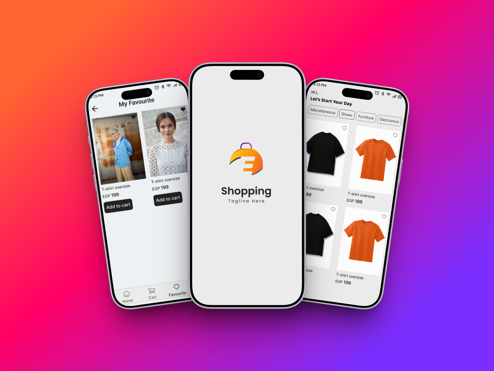

# 👕 E-Commerce Clothing App  

An **E-commerce mobile application** built with **Flutter**, using **REST API** for fetching data, **Cubit (Bloc)** for state management, and **Hive** for local storage.  
The app provides a smooth experience to browse clothing items, view product details, and manage favorites.  

---

## 📸 Screenshots  

---

## 🎥 Demo Video  
[

---

## 📂 Project Structure  

